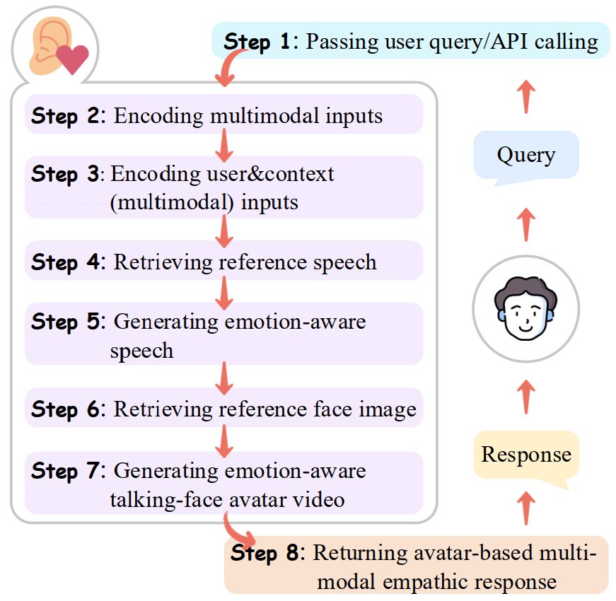
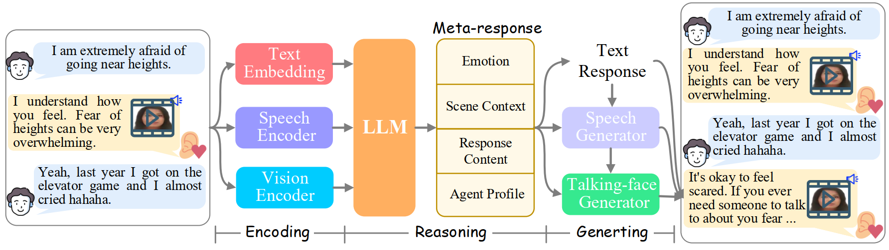

<div align="center">

#   EmpathyEar: An Open-source Avatar Multimodal Empathetic Chatbot

[Hao Fei](http://haofei.vip/), [Han Zhang](#),  [Bin Wang](#),  [Lizi Liao](https://liziliao.github.io/), 
[Qian Liu](https://profiles.auckland.ac.nz/liu-qian/), and [Erik Cambria](https://sentic.net/).


</div>
<div align="justify">


This is the repository that contains the source code for the ACL 2024 Demo of [**EmpathyEar: An Open-source Avatar Multimodal Empathetic Chatbot**](https://arxiv.org/abs/2406.15177).
EmpathyEar is a pioneering open-source, avatar-based multimodal empathetic chatbot, to fill the gap in traditional text-only empathetic response generation (ERG) systems.    


# Demonstration


https://github.com/scofield7419/EmpathyEar/assets/18722770/082b238f-dbf2-42a4-a238-abae88fdb110


# Workflow

<p align="center" width="60%">
<a target="_blank"></a>
</p>


# Framework Architecture

<p align="center" width="100%">
<a target="_blank"></a>
</p>


# Quick Start

## Prepare pre-trained models
 1. Download ChatGLM3 chekpoints from <https://huggingface.co/THUDM/chatglm3-6b/tree/main> and place it in the [ChatGLM-6B](chatglm/chatglm-6b-base) folder.
 2. Download pre-trained ChatGLM3 lora checkpoints from <https://pan.baidu.com/s/14zzdxyRZL3dqBmI2hJPlIw?pwd=qj4w> and place it in the [ChatGLM-6B](chatglm/chatglm-6b-base) folder. You can also fine-tune ChatGLM by following these steps:
- ```cd chatglm```
- ```./scripts/finetune_lora.sh```

 3. Download the pre-trained StyleTTS2 model on LibriTTS at <https://huggingface.co/yl4579/StyleTTS2-LibriTTS/tree/main> and place it in the [StyleTTS2-LibriTTS](StyleTTS2/StyleTTS2-LibriTTS) folder.
 4. Download the pretrained models for EAT and place them in the [ckpt](EAT/ckpt),[Utils] folder respectively according to the following steps.
    >gdown --id 1KK15n2fOdfLECWN5wvX54mVyDt18IZCo && unzip -q ckpt.zip -d ckpt  
    >gdown --id 1HGVzckXh-vYGZEUUKMntY1muIbkbnRcd && unzip -q Utils.zip -d Utils

## Create conda environment
- ```conda env create -f environment.yml```
- ```conda activate empathyear```

## Test on Empathetic Dialogue dataset
- ```python inference.py```  
The generated TTS wav files will be saved in [TTS_audio](TTS_results), and the generated talking face videos will be saved in [MP4_video](MP4_results).


# Acknowledge
We acknowledge these works for their public codes: 
[ChatGLM3](https://huggingface.co/google/flan-t5-xxl), 
[ImageBind](https://github.com/facebookresearch/ImageBind), 
[StyleTTS2](https://github.com/ZET-Speech/ZET-Speech-Demo), 
[EAT](https://github.com/yuangan/EAT_code).
</div>


# License Notices
This repository is under [BSD 3-Clause License](LICENSE.txt).
EmpathyEar is a research project intended for non-commercial use only. 
One must NOT use the code of EmpathyEar for any illegal, harmful, violent, racist, or sexual purposes. 
One is strictly prohibited from engaging in any activity that will potentially violate these guidelines.
Any potential commercial use of this code should be approved by the authors.


