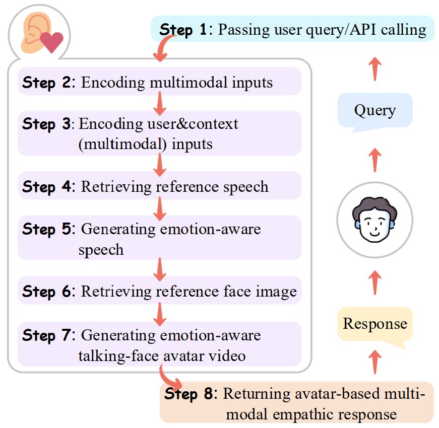
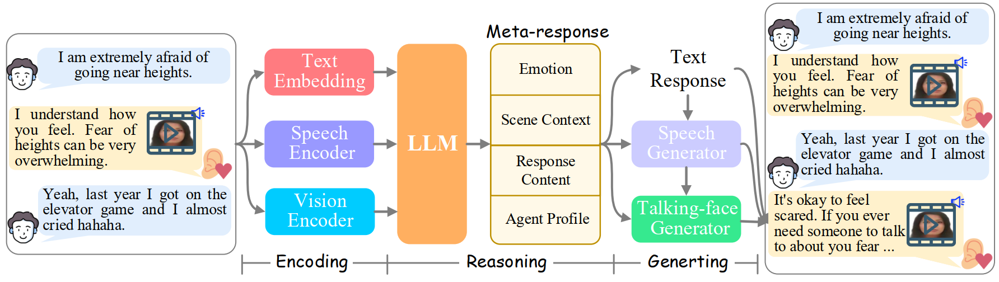

#   EmpathyEar: An Open-source Avatar Multimodal Empathetic Chatbot

[Hao Fei](http://haofei.vip/)*, [Han Zhang](#),  [Bin Wang](#),  [Lizi Liao](https://liziliao.github.io/), 
[Qian Liu](#), and [Erik Cambria](https://sentic.net/).

This is the repository that contains the source code for the ACL Demo of **EmpathyEar project**.

# Demonstration

# Workflow

# Framework Architecture

# Acknowledge
We acknowledge these works for their public codes: 
[Flan-T5](https://huggingface.co/google/flan-t5-xxl), 
[ImageBind](https://github.com/facebookresearch/ImageBind), 
[ZET-Speech (unofficial)](https://github.com/ZET-Speech/ZET-Speech-Demo), 
[EAT](https://github.com/yuangan/EAT_code).

# License Notices
This repository is under [BSD 3-Clause License](LICENSE.txt).
EmpathyEar is a research project intended for non-commercial use only. 
One must NOT use the code of EmpathyEar for any illegal, harmful, violent, racist, or sexual purposes. 
One is strictly prohibited from engaging in any activity that will potentially violate these guidelines.
Any potential commercial use of this code should be approved by the authors.

